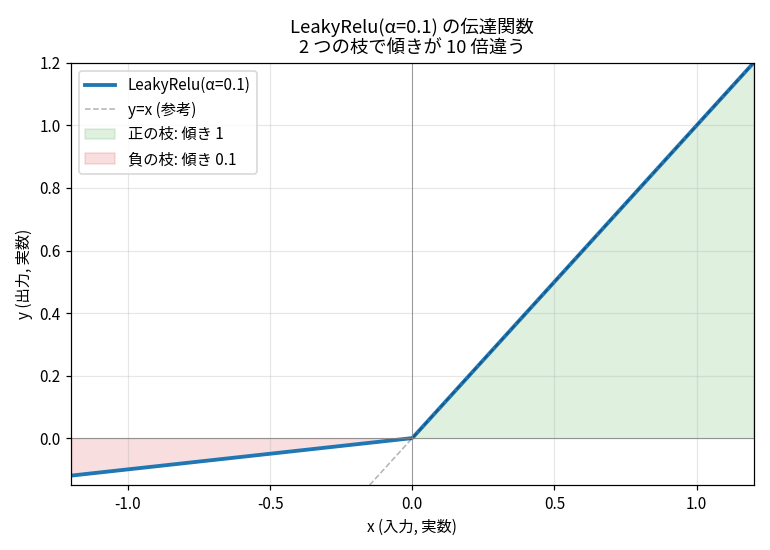
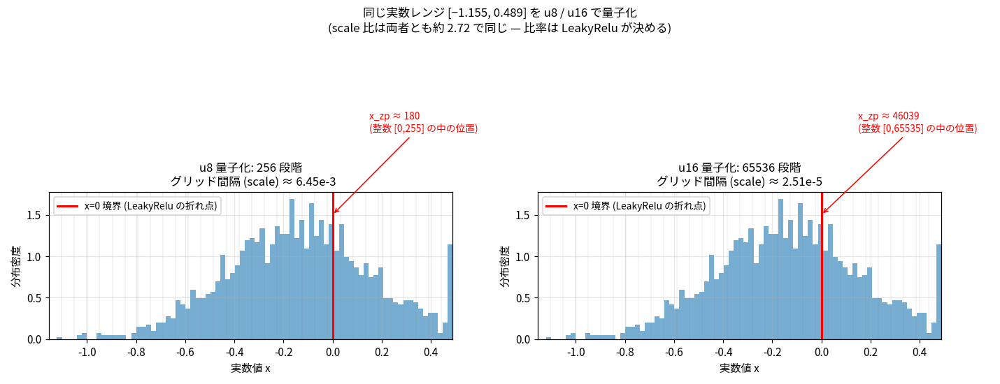
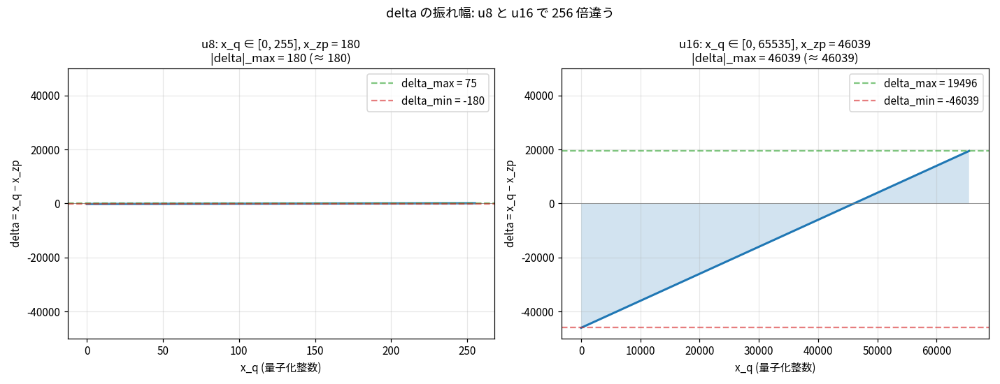
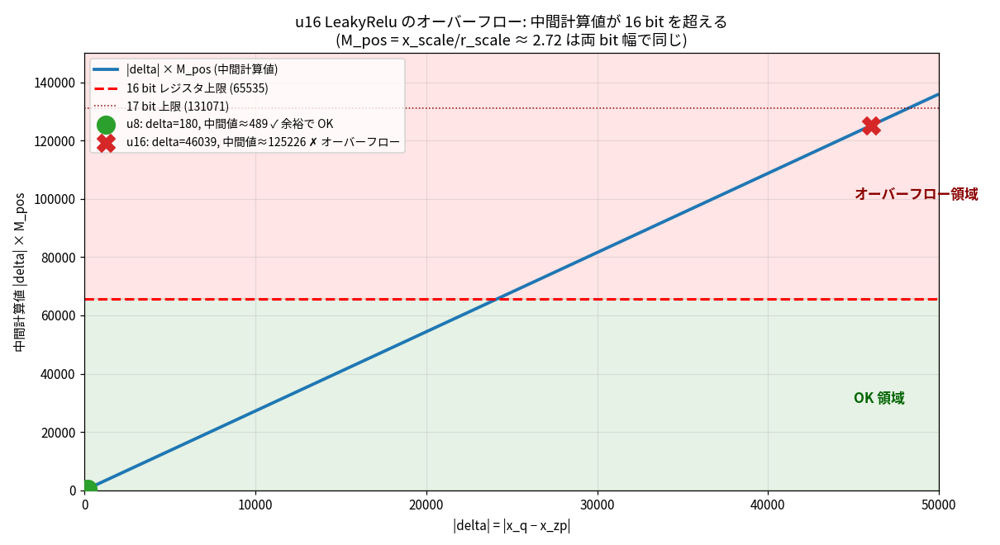
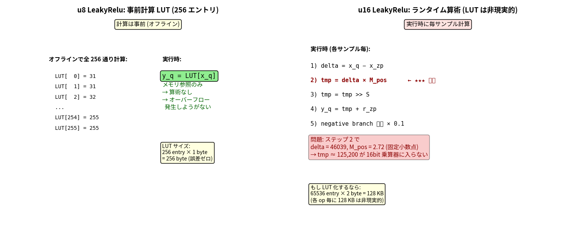

# u16 量子化 LeakyRelu のオーバーフロー解析

**問題**: piper-plus tsukuyomi-chan の HiFiGAN decoder を u16 量子化で AX650 NPU 用に pulsar2 でビルドすると、`compiler.check=2` 時に以下のエラーで失敗:

```
AxQuantizedLeakyRelu, integer 131071 does not fit 'uint16_t'
op: /dec/resblocks.6/LeakyRelu_1
x_scale=2.5076835e-05, x_zeropoint=46039
r_scale=9.221705e-06,  r_zeropoint=12520
negative_slope=0.10000000149011612
```

ビルドは check=0 (検証スキップ) で通せば成功するが、**実機 NPU で execute 時に `AXCL_ERR_ENGINE_EXECUTE_FAIL` で失敗**する。

このレポートでは「なぜ u16 は overflow して u8 は OK なのか」を 5 枚の図で順を追って説明する。

---

## TL;DR

| 観点 | u8 | u16 |
|---|---|---|
| 量子化レベル数 | 256 | 65,536 |
| `x_zeropoint` (実数 0 を表す整数値) | 約 180 | 約 46,039 |
| `\|delta\| = \|x_q − x_zp\|` の最大値 | 約 180 | 約 46,039 |
| 中間計算値 `delta × M_pos` (M_pos ≈ 2.72) | 約 490 | **約 125,200** |
| 再量子化 ALU 出力 (出力データ型と同じ幅) に収まるか | ✅ (LUT 実装で計算自体不要) | ❌ uint16 をオーバーフロー |
| ハードウェア実装 | LUT (256 byte の事前計算表) | ランタイム算術 (毎サンプル乗算) |

---

## 1. 出発点: LeakyRelu(α=0.1) の伝達関数

LeakyRelu は入力の符号で**傾きが変わる**非線形関数:

```
y = x         (x ≥ 0 のとき, 傾き 1)
y = 0.1 × x   (x < 0 のとき, 傾き 0.1)
```



正の枝と負の枝で**傾きが 10 倍違う**。後でこの「10 倍」が量子化計算の bit 幅に響いてくる。

---

## 2. 量子化グリッド: u8 と u16 で精度は違うが、scale 比は同じ

実数値 `x ∈ [−1.155, 0.489]` を量子化する。

- **u8** : 256 段階 → `x_scale` (1 段階あたりの実数幅) ≈ **6.45 × 10⁻³**
- **u16**: 65,536 段階 → `x_scale` ≈ **2.51 × 10⁻⁵** (256 倍細かい)



### scale 比 ≈ 2.72 の出どころ

LeakyRelu(α=0.1) を通すと、入力の負側だけ 1/10 に縮むので**出力レンジが入力レンジより小さくなる**:

```
入力レンジ  : 0.489 − (−1.155)        = 1.644
出力レンジ  : 0.489 − (−1.155 × 0.1)  = 0.489 + 0.1155 = 0.604
レンジ比    : 1.644 / 0.604           ≈ 2.72
```

量子化器は「実レンジ ÷ 量子化段数」で `scale` を決めるので、段数が同じなら **scale 比 = 実レンジ比** がそのまま出る:

```
M_pos = x_scale / r_scale ≈ 2.72   ← この比は u8/u16 どちらでも同じ
```

この比 2.72 は **LeakyRelu の伝達特性そのものから決まる量** で、calibration 法 (MinMax / Percentile / MSE) を変えても変わらない (実際に 3 方式で検証して全部 ≈ 2.72 だった、Appendix B 参照)。

---

## 3. ハードウェアで何を計算しているか

量子化 LeakyRelu の数式 (正の枝):

```
y_real = x_real
       = (x_q − x_zp) × x_scale          ← 実数復号
y_q    = round(y_real / r_scale) + r_zp   ← 再量子化
       = round((x_q − x_zp) × M_pos) + r_zp
ただし M_pos = x_scale / r_scale (≈ 2.72)
```

ハードウェアは固定小数点で `M_int = round(M_pos × 2^S)` を整数化して持ち、毎サンプル整数乗算+シフトで再量子化する:

```
delta = x_q − x_zp           ← 引き算 (32 bit アキュムレータ内)
prod  = delta × M_int        ← 32 bit 内で乗算 (作業レジスタは広い)
tmp   = prod >> S            ★★★ ここの結果は「出力データ型」幅に収まる必要あり
y_q   = clamp(tmp + r_zp, 0, 出力型 max)   ← 最終クランプ
(負の枝なら × 0.1 が追加で入る)
```

**重要なポイント** — 「u8」「u16」は**テンソルのデータ型** (= メモリ上のサイズ) のことで、内部の乗算アキュムレータはもっと広い (典型的には 32 bit)。だが AX650 の再量子化 ALU には:

> **★ の `tmp` を出力データ型と同じ幅 (u16 出力なら uint16) のレジスタに保持する**

という制約がある。これがあとで効いてくる。

---

## 4. `delta` の振れ幅は zero_point の位置で決まる

```
delta = x_q − x_zp
```

このグラフが今回の主役:



### `x_zp` はどこから来る数字か

非対称量子化では「実数 0 を表す整数値」が `zero_point` で、入力レンジが**負側に偏っている** (`−1.155 ~ +0.489`) ため、整数軸でも 0 の位置が**上の方にズレる**。

**u8 の場合**:
```
x_zp = round(−min_real / x_scale) = round(1.155 / 6.45e-3) ≈ 180

整数軸 [0, 255] 上:
0 ─────────────── 180 ── 255
↑                ↑      ↑
x=−1.155        x=0    x=+0.489
```

→ `delta = x_q − x_zp ∈ [0−180, 255−180] = [−180, +75]` → `|delta|_max = 180`

**u16 の場合**:
```
x_zp = round(1.155 / 2.51e-5) ≈ 46,039

整数軸 [0, 65535] 上:
0 ─────────────── 46,039 ─── 65,535
↑                ↑          ↑
x=−1.155        x=0         x=+0.489
```

→ `delta ∈ [−46039, +19496]` → `|delta|_max = 46,039`

**256 倍細かい量子化なので zp も 256 倍大きく、その結果 `|delta|_max` も 256 倍**になる。

---

## 5. 中間値 `delta × M_pos` がオーバーフローする

ステップ ★★★ の中間値 `delta × M_pos` を u8/u16 それぞれで:



### 実エラーログの数値で計算してみる

```
x_zeropoint = 46,039,  M_pos = 2.5076835e-5 / 9.221705e-6 = 2.71947...
```

最も負側の入力 `x_q = 0` を入れると:

```
delta = 0 − 46039 = −46,039
|delta × M_pos| = 46,039 × 2.71947 ≈ 125,203   ← これが ★ の tmp
```

| 値 | 必要 bit |
|---|---|
| `125,203` | **17 bit** (`2^17 = 131,072`) |
| u16 出力レジスタ上限 | `65,535` (16 bit) |

→ **約 1.91 倍超過、構造的に絶対に入らない**

pulsar2 の checker は overflow を検出し、飽和上限 `131,071 = 2^17 − 1` を使ってエラーを報告:
```
AxQuantizedLeakyRelu, integer 131071 does not fit 'uint16_t'
```

(真値は `≈ 125,203`、`131,071` は pulsar2 の検査時の 17bit クランプ値)

### u8 を同じ式で計算してみると

```
delta = 0 − 180 = −180
|delta × M_pos| = 180 × 2.72 = 489.6 ≈ 490
```

→ 490 は 16bit にも 17bit にも余裕で収まる。**u8 では算術的にオーバーフローしない**。

---

## 6. なぜ u8 はそもそも問題にならないのか — ハードウェア実装の違い

ここが根本の理解。



### u8 LeakyRelu — **LUT (Look-Up Table) 実装**

入力 `x_q` の取りうる値はたったの **256 通り**だから、ビルド時 (PC 上) にすべての出力を事前計算して 256 byte の表に入れておける:

```
ビルド時 (PC 上、float または 32bit 整数で計算):
  for x_q in 0..255:
      tmp = (x_q − x_zp) × M_pos        ← 例: 490 とか計算しても問題なし
      tmp = round(tmp) >> S
      y_q = clamp(tmp + r_zp, 0, 255)   ← uint8 にクランプ
      LUT[x_q] = y_q                    ← 1 byte だけ保存

実行時 (NPU 上):
  y_q = LUT[x_q]                        ← 表引きのみ。乗算は走らない
```

**`490` という値は最終的に LUT に保存される 1 byte の中には**現れない (clamp 後の値しか保存されない)。中間計算は PC 上の幅広い演算でやっているので、bit 幅制約は実質ない。

→ **計算段階そのものが NPU に存在しないので、オーバーフローしようがない**

### u16 LeakyRelu — **ランタイム算術実装**

LUT を作ろうとすると `65,536 entry × 2 byte = 128 KB / op`、HiFiGAN decoder には LeakyRelu が ~25 個あるので **3 MB 以上** になり現実的でない。

→ そのため**毎サンプル**で NPU の再量子化 ALU に通して `delta × M_int >> S + r_zp` を計算する。

→ 再量子化 ALU の出力幅が**出力データ型 (uint16) と同じ**なので、`tmp = 125,203` がここに入らず詰む。

### 「u8 でもこの計算をしたら 490 は 8bit を超えるのでは？」

よくある誤解だが、**「データ型の幅」と「内部レジスタの幅」は別物**。

```
入力テンソル        ALU 内部                  出力テンソル
[uint8 格納]   →   [int32 アキュムレータ]    →   [uint8 格納]
  8 bit             32 bit                       8 bit
                    ↑
                    490 はここで一時的に存在し、
                    最終的に clamp(0, 255) で 255 に丸められる
```

CPU でも `uint8_t a, b; int c = a * b;` で 一時的に 65,025 を持てるのと同じ。NPU も入出力テンソルは 8 bit でも内部の乗算は 32 bit アキュムレータで行う。

ただし AX650 の**再量子化ステージの出力レジスタは出力データ型と同じ幅**しかない。u8 出力の場合は LUT 実装に逃げているので関係ないが、u16 出力ではこの 16 bit 制約が直接効いてしまう。

---

## 7. 一般化: どのアクティベーションが u16 で overflow しやすいか

本ケースは LeakyRelu の事例だが、同じ原理から「どんな関数が危ないか」を予測できる。

### 一般則

```
|delta × M_pos| ≤ 65,535     ← u16 出力で詰まる条件
ここで |delta|_max ≈ x_zeropoint (非対称量子化の場合)
      M_pos = 入力レンジ / 出力レンジ
```

→ **「出力レンジが入力レンジより縮む関数」 = M_pos > 1 = overflow リスク** という構造。

### u16 で安全な M_pos の上限目安

| `\|delta\|_max` の状況 | 安全な M_pos の上限 |
|---|---:|
| zp が整数軸のほぼ中央 (対称分布) | `65535 / 32768 ≈ 2.0` |
| zp が端寄り (本ケースのような非対称分布) | `65535 / 46039 ≈ 1.4` |
| zp が極端に端 (片側分布) | `65535 / 65535 = 1.0` |

→ **u16 で安全圏は実質 `M_pos ≤ 1` 付近、`M_pos > 2` はほぼ確実に詰む**。

### アクティベーション別の overflow しやすさ

#### ❌ overflow しやすい (出力レンジを縮める系)

| 関数 | 典型 M_pos | 理由 |
|---|---:|---|
| **LeakyRelu (α=0.1)** | 2〜3 | 負側を 1/10 圧縮 ← **本ケース** |
| **LeakyRelu (α=0.01)** | 5〜50 | 負側ほぼ潰れる、最悪級 |
| **PReLU (slope < 1)** | 同上 | LeakyRelu と同じ構造 |
| **Tanh** | 入力レンジ次第で 2〜20+ | 出力 [−1,+1] に bound、入力が広いと壊滅 |
| **Sigmoid** | 入力レンジ次第で 4〜40+ | 出力 [0,1] に bound、Tanh より厳しい |
| **HardTanh / ReLU6 / HardSigmoid** | clamp 値による | 出力上下限が固定、入力が広いと M_pos 大 |
| **HardSwish** | 状況次第 | 一部レンジを潰す |

#### ⚠️ 条件次第 (実装で救われることが多い)

| 関数 | コメント |
|---|---|
| **ReLU** | 数学的には M_pos が 1〜2 程度になりうるが、「正側パススルー、負側 r_zp クランプ」の特殊実装で再量子化を回避するのが通例 |
| **Tanh / Sigmoid** | 区分線形近似 + 複数 LUT、区間縮約 + 多項式など、特殊実装で逃げる NPU 実装も多い。pulsar2 がランタイム算術で実装するなら LeakyRelu と同じ目に合う |

#### ✅ overflow しにくい (出力レンジを保つ・拡大する系)

| 関数 | M_pos 目安 | 理由 |
|---|---:|---|
| **Identity / Linear (恒等)** | 1.0 | 入力レンジ = 出力レンジ |
| **GELU** | 1.0〜1.3 | 大きな正の x で `y ≈ x`、小さな負側を少し縮めるだけ |
| **SiLU / Swish** | 1.0〜1.3 | GELU と類似 |
| **Softplus** | < 1 (拡大方向) | 出力が入力より「広がる」こともある |
| **ELU (α=1)** | 約 1 | 負側を `e^x − 1` で [−1,0] に縮めるので Tanh より緩い |
| **Mish** | 約 1 | GELU 系統 |

### LeakyRelu(α=0.1) が中途半端に最悪な理由

α=0.1 は **「LUT で逃げるには連続的すぎ、ランタイム算術で計算すると overflow する」** という板挟みに位置する:

| α | 性質 | NPU 実装 |
|---|---|---|
| α = 0 (= ReLU) | 負側を完全に潰す | 「負ならゼロ点クランプ」の特殊回路で OK |
| **α = 0.1 (LeakyRelu)** | **負側を縮めるが残す** | **算術必要 → M_pos ≈ 2.72 → u16 で死亡** |
| α = 1 (= Identity) | 何もしない | パススルー |

α が 0 と 1 のちょうど中間にあるせいで、**両側で異なる線形変換が必要 → 必ず再量子化が走る → 出力レンジが入力より縮む → M_pos > 1 確定**、という性質を持つ。

### 設計指針

- u16 化したいモデルでは、**LeakyRelu / PReLU / 狭いレンジに落とす Tanh/Sigmoid** は要注意
- pulsar2 で詰まったら、まず該当 op を `compiler.check=2` で検出
- 回避策は基本「**該当 op だけ U8 に降格して LUT 実装に逃がす**」(本ケースで採用、quality 影響は cos 0.995 程度)
- モデル設計の段階から選ぶなら、**GELU / SiLU / Identity 系は overflow フリー** で u16 化に向く

---

## 8. 結論と回避策

| 案 | 効果 | 採否 |
|---|---|---|
| calibration 法を変える (MinMax → Percentile/MSE) | `M_pos = x_scale/r_scale` の比は LeakyRelu の伝達特性で決まり不動 → 効かない | ✗ |
| `enable_onnxsim: false` | onnxsim は overflow に関与していない | ✗ |
| `transformer_opt_level: 1` | Transformer 系の最適化なので CNN/HiFiGAN には無関係 | ✗ |
| 単一 `LeakyRelu_1` のみ U8 降格 | 同じく overflow する別の LeakyRelu (`resblocks.7/LeakyRelu` 等) で詰む | ✗ |
| **全 LeakyRelu を U8 降格** (`op_type: LeakyRelu` → `data_type: U8`) | LUT 実装に切替わり overflow 消滅、品質劣化は decoder cos 0.995 で許容範囲 | ✅ **採用** |

最終 config (抜粋):

```json
"layer_configs": [
  { "start_tensor_names": ["DEFAULT"], "end_tensor_names": ["DEFAULT"], "data_type": "U16" },
  { "op_type": "LeakyRelu", "data_type": "U8" }
]
```

成果物:
- `axmodel/tsukuyomi-decoder-u16_ax650.axmodel` (3.27 MB, mixed precision: 全体 U16 + LeakyRelu のみ U8)
- 実機 1Core で 41 ms / E2E パイプライン 64 ms / RTF 0.019 で動作

---

## Appendix A: 検証した 7 通りのビルド結果

| # | 試行 | calibration | layer_configs | 結果 |
|---|---|---|---|---|
| 1 | 元 (check=0) | MinMax | 全 U16 | ビルド OK / 実機 execute fail |
| 2 | check=2 だけ追加 | MinMax | 全 U16 | overflow 検出 (resblocks.6/LRelu_1) |
| 3 | onnxsim 無効 | MinMax | 全 U16 | 同じ overflow (onnxsim 無関係) |
| 4 | Percentile | Percentile | 全 U16 | 同じ overflow (scale tight 化、悪化方向) |
| 5 | MSE | MSE | 全 U16 | 同じ overflow (delta 振幅増、悪化方向) |
| 6 | transformer_opt_level=1 | MinMax | 全 U16 | 同じ overflow (HiFiGAN に効果なし) |
| 7 | 単一 LRelu_1 のみ U8 | MinMax | resblocks.6/LRelu_1 → U8 | 別 LRelu (resblocks.7) で同じ overflow |
| **8** | **全 LeakyRelu を U8** | **MinMax** | **op_type=LeakyRelu → U8** | ✅ **ビルド成功 + 実機動作 (RTF 0.019)** |

## Appendix B: 3 つの calibration 法での scale 値

`/dec/resblocks.6/LeakyRelu_1` の量子化パラメータ:

| 方式 | x_scale | x_zp | r_scale | r_zp | x_scale/r_scale |
|---|---:|---:|---:|---:|---:|
| MinMax | 2.51 × 10⁻⁵ | 46,039 | 9.22 × 10⁻⁶ | 12,520 | 2.72 |
| Percentile | 1.87 × 10⁻⁵ | 45,919 | 6.91 × 10⁻⁶ | 12,431 | 2.71 |
| MSE | 8.02 × 10⁻⁴ | 1,439 | 2.95 × 10⁻⁴ | 391 | 2.72 |

→ scale 値そのものは calibration 法で大きく変わるが、**比 (M_pos) は LeakyRelu の伝達関数で決まる定数**で動かない。
